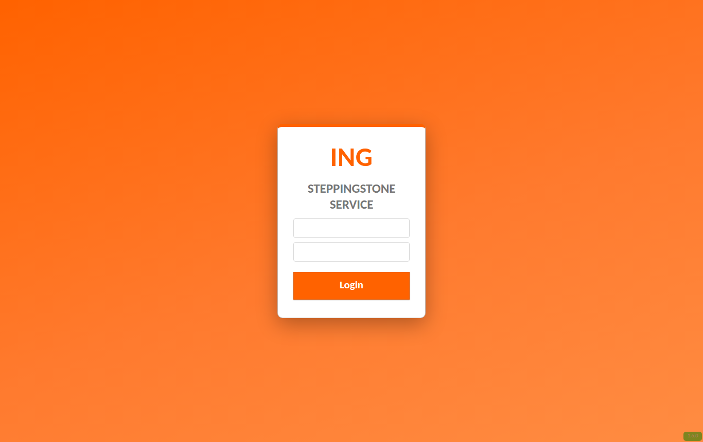
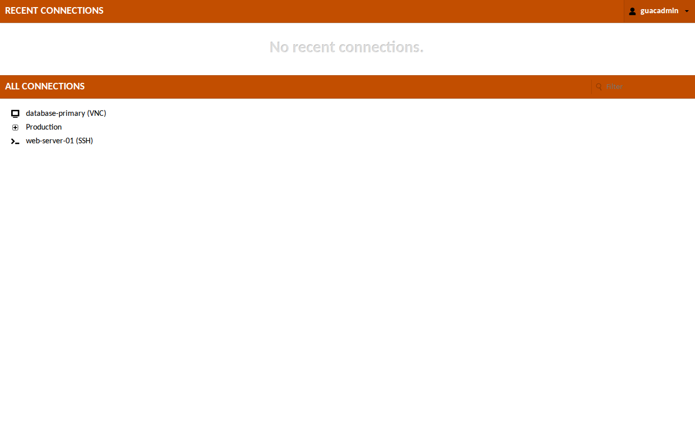
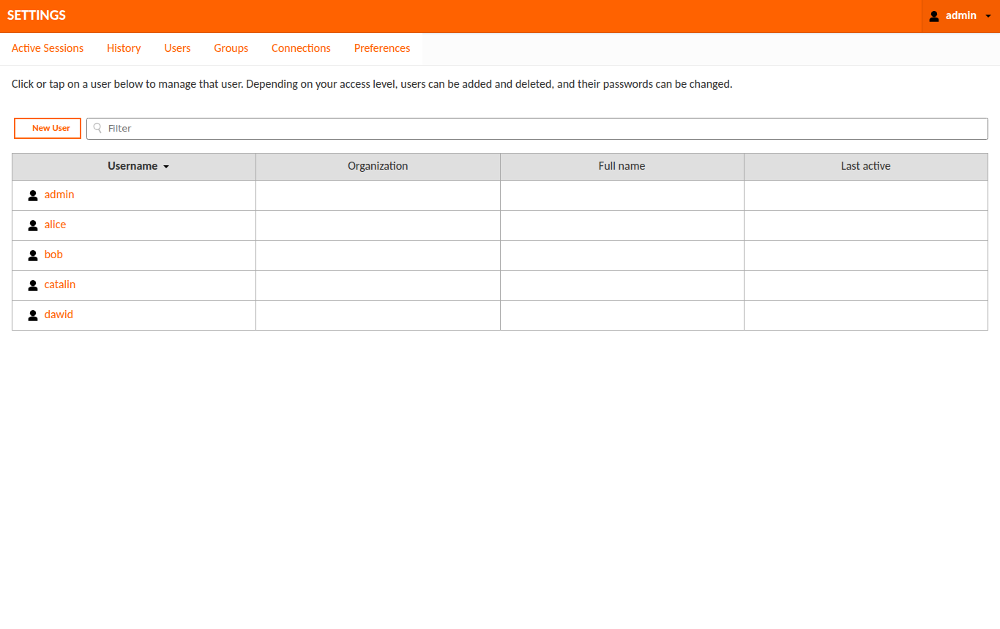
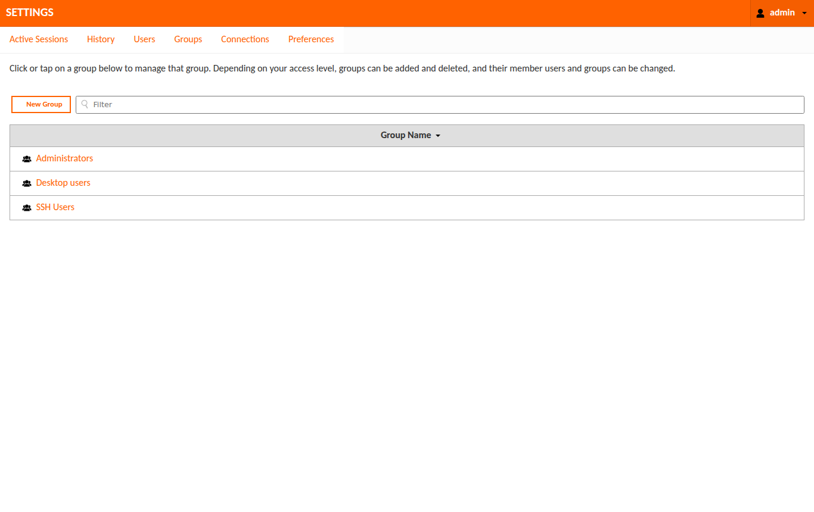

<div align="center">

<h1>🦁</h1>

<h1>OrangeLion</h1>

**A drop-in orange theme for Apache Guacamole**

[](LICENSE)
[](https://guacamole.apache.org/)
[](guac-manifest.json)
[](CONTRIBUTING.md)
[](https://github.com/rupivbluegreen/orangelion-theme/actions/workflows/build.yml)
[](https://github.com/rupivbluegreen/orangelion-theme/releases/latest)
[](https://github.com/rupivbluegreen/orangelion-theme/releases)
[](https://rupivbluegreen.github.io/orangelion-theme/)

</div>

OrangeLion is a CSS-only theme extension for Apache Guacamole. It repaints the login page, menus, header bars, buttons, connection list, and admin settings screens in the orange colour scheme, using a lion emoji mark rather than any trademarked logo. It ships as a single `.jar` that you drop into your Guacamole extensions folder, so it layers on top of any install without rebuilding the web app. This project is unofficial and community-maintained.

## Contents

- [Screenshots](#screenshots)
- [Features](#features)
- [Install](#install)
- [Customize](#customize)
- [Compatibility](#compatibility)
- [FAQ](#faq)
- [Roadmap](#roadmap)
- [Contributing](#contributing)
- [License](#license)

## Screenshots

| Login | Connections |
| --- | --- |
|  |  |

| Admin: Users | Admin: Groups |
| --- | --- |
|  |  |

## Features

- orange (`#FF6200`) colour palette applied across the interface.
- White login card with a lion emoji mark (a standard Unicode glyph, not a trademarked logo).
- Themed menu, header bars, and buttons.
- Themed connection list and admin settings pages (Users, Groups, and more).
- Single-file, drop-in extension: just copy one `.jar`.
- No web-app rebuild and no source changes to Guacamole.
- Configurable through CSS variables at the top of the stylesheet.
- Optional product-name rename on the login page via a translation override.
- Custom browser-tab favicon and app icon (an orange lion mark).
- Accessible by default: [WCAG AA contrast](docs/ACCESSIBILITY.md) across text, borders, and focus indicators, a visible keyboard focus ring, and brand-coloured form controls.

## Install

Download the latest `guacamole-theme-orangelion.jar` from the [Releases](https://github.com/rupivbluegreen/orangelion-theme/releases) page, or use the prebuilt copy in `dist/` in this repo.

Quick version:

1. Copy `guacamole-theme-orangelion.jar` into `GUACAMOLE_HOME/extensions/`.
2. Restart Guacamole.
3. Hard refresh your browser (Ctrl+Shift+R, or Cmd+Shift+R on macOS) to clear cached CSS.

Copy the jar into place:

```bash
mkdir -p "$GUACAMOLE_HOME/extensions" && cp guacamole-theme-orangelion.jar "$GUACAMOLE_HOME/extensions/"
```

Docker note: with the official Guacamole image, mount a folder that contains `extensions/guacamole-theme-orangelion.jar` and set the `GUACAMOLE_HOME` environment variable to point at that folder, then restart the container. For Docker Compose:

```yaml
services:
  guacamole:
    image: guacamole/guacamole
    environment:
      GUACAMOLE_HOME: /etc/guacamole
    volumes:
      - ./guacamole:/etc/guacamole
```

Place `guacamole-theme-orangelion.jar` in `./guacamole/extensions/`, then restart the container.

After restarting, the Guacamole log should show: `Extension "OrangeLion Theme" (orangelion) loaded`

Finally, hard refresh your browser (Ctrl+Shift+R, or Cmd+Shift+R on macOS) to clear cached CSS so the new theme loads.

For full step-by-step instructions, customisation options, and uninstall steps, see [INSTRUCTIONS.md](INSTRUCTIONS.md). Deploying on Docker, Kubernetes, or OpenShift? See [docs/DEPLOYMENT.md](docs/DEPLOYMENT.md).

## Customize

The quickest way to restyle is with build options — no CSS editing. `build.sh` reads them from environment variables, or from a `theme.config` file (copy `theme.config.example`):

- Recolour everything: `BRAND_COLOR=#1565C0 ./build.sh` (the darker shades are derived automatically).
- Custom login mark: `WORDMARK="Acme" ./build.sh`, or a logo image with `LOGO=images/my-logo.svg ./build.sh`.
- Rename the product on the login page/tab: `APP_NAME="Acme Remote" LOCALES="en nl de" ./build.sh`.
- Theme-only build with no OrangeLion branding (keeps Guacamole's own logo and name): `VARIANT=neutral ./build.sh`.

See [INSTRUCTIONS.md](INSTRUCTIONS.md#5-customize-with-build-options-recommended) for the full option reference.

You can also hand-edit the CSS variables in the `:root` block at the top of `orangelion.css`:

| Variable | Default | Controls |
| --- | --- | --- |
| `--brand-orange` | `#FF6200` | Bright brand accent: login backdrop, mark, borders |
| `--brand-orange-dark` | `#E15700` | Primary-button border edge |
| `--brand-orange-darker` | `#C24E00` | Accessible orange: text + white-on fills (4.79:1) |
| `--brand-orange-deep` | `#A84300` | Deep hover fill (6.06:1 on white) |
| `--brand-charcoal` | `#333333` | Body text |
| `--brand-grey` | `#767676` | Secondary text |
| `--brand-border` | `#8C8C8C` | Input borders (3.36:1 on white) |
| `--brand-white` | `#FFFFFF` | Cards / text on orange |
| `--brand-page` | `#FFFFFF` | Page background |

Worked example, recolour to blue: run `BRAND_COLOR=#1565C0 ./build.sh`, or set `--brand-orange`, `--brand-orange-dark`, and `--brand-orange-darker` to your blue shades in the `:root` block by hand and rebuild.

After any change, rebuild the jar with `build.sh` (output: `dist/guacamole-theme-orangelion.jar`), then reinstall and hard refresh.

## Compatibility

The manifest declares `guacamoleVersion` `"*"`, and the theme has been tested on Guacamole 1.5.5 and 1.6.0.

## FAQ

**Is this affiliated with Apache Guacamole?**
No. OrangeLion is unofficial, community-maintained, and unaffiliated with the Apache Guacamole project.

**Does it change functionality or only appearance?**
Only appearance. It is CSS-only and changes no behaviour.

**Will it conflict with LDAP, database, SAML, or other extensions?**
No. It is a CSS-only extension and does not touch authentication or other extension logic.

**Does it work with both the WAR/Tomcat install and the Docker image?**
Yes, both are supported.

**Does it work on older Guacamole such as 1.4?**
The manifest sets `guacamoleVersion` to `"*"`, and the theme is tested on 1.5.5 and 1.6.0. Older versions may work but are untested.

**Is it safe for production?**
It only adds CSS, so risk is limited to appearance.

## Roadmap

Planned improvements are tracked as [issues](https://github.com/rupivbluegreen/orangelion-theme/issues). Highlights include a configurable brand colour and wordmark, optional SVG logo support, a dark-mode variant, CI-built tagged releases, a WCAG contrast audit, and a documented Guacamole version compatibility matrix. Contributions toward any of these are welcome.

## Contributing

Contributions are welcome. Please read [CONTRIBUTING.md](CONTRIBUTING.md), then open an issue or a pull request with your ideas, fixes, or improvements. This project also follows a [Code of Conduct](CODE_OF_CONDUCT.md).

## License

Released under the MIT License. See [LICENSE](LICENSE).
