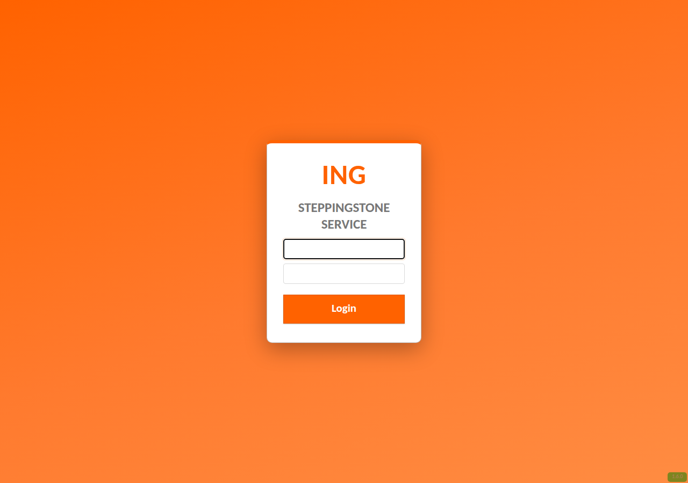

# OrangeLion, an ING flavored theme for Apache Guacamole

A drop in [Apache Guacamole](https://guacamole.apache.org/) theme in the ING
color palette. It uses bold ING Orange (`#FF6200`), a clean white login card, an
"ING" wordmark, and orange menu and header bars. It ships as a standard
Guacamole CSS extension (a `.jar`), so it layers on top of any Guacamole install
without rebuilding the web app.



> Unofficial and not affiliated with or endorsed by ING. This is a community
> color theme. It ships no ING logo. The login mark is a plain "ING" text
> wordmark that you can change in one line (see Customize).

## Install and use

Full step by step instructions are in [INSTRUCTIONS.md](INSTRUCTIONS.md).

The short version: copy `dist/orangelion.jar` into your Guacamole
`GUACAMOLE_HOME/extensions/` directory, restart Guacamole, and hard refresh the
browser. For the official Docker image, mount a folder that contains
`extensions/orangelion.jar` and set the `GUACAMOLE_HOME` environment variable to
that folder.

## What is in the box

| File | Purpose |
|------|---------|
| `guac-manifest.json` | Guacamole extension manifest (namespace `orangelion`, declares the CSS) |
| `orangelion.css` | The theme: palette variables plus login, buttons, menu, and connection list styling |
| `translations/en.json.example` | Optional rename of the product on the login page (`APP.NAME`) |
| `build.sh` | Packs the files into `dist/orangelion.jar` |
| `dist/orangelion.jar` | Prebuilt extension, ready to drop in |
| `INSTRUCTIONS.md` | Detailed install, customize, and uninstall guide |

## Customize

Everything is driven by CSS variables at the top of `orangelion.css`:

```css
:root {
    --ing-orange:      #FF6200;   /* primary accent */
    --ing-orange-dark: #E15700;   /* button hover   */
    --ing-charcoal:    #333333;   /* body text      */
    /* ... */
}
```

1. Recolor for another brand: change these values, then run `./build.sh`.
2. Change the login wordmark: edit the `.login-ui .login-dialog .logo::after`
   rule (the `content: "ING"` line), or point `.logo` at a real background image.
3. Rename the product on the login page and browser tab: copy
   `translations/en.json.example` to `translations/en.json`, edit `APP.NAME`,
   then run `./build.sh` (the build includes it automatically when present).

## Compatibility

`guacamoleVersion` is set to `*`, and the selectors are stable across Guacamole
1.5.x and 1.6.x. Tested on 1.5.5 and 1.6.0.

## License

[MIT](LICENSE).
